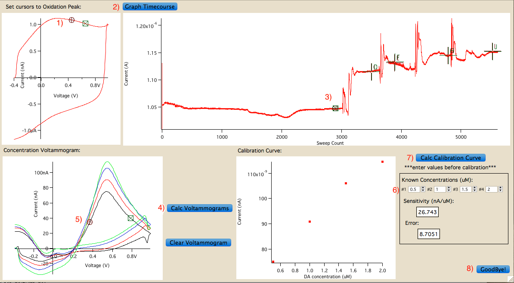

## Overview

This repository consists of custom written procedural files (*.ipf) to clean and calibrate Fast-Scan-Cyclic Voltammetry (FSCV) data recorded from a HEKA EPC8 amplifier with an LIH8+8 digitizer. [Data cleaner script](https://github.com/gdq12/ElectroChemical_FSCV_Analysis_IgorProv6.37/blob/master/data_cleaner.ipf) was created to circumvent a Patchmaster limitation (elaborated below), and the [calibration script](https://github.com/gdq12/ElectroChemical_FSCV_Analysis_IgorProv6.37/blob/master/calibration.ipf) renders the GUI for electrode calibration analysis.

## Data Cleaner

### Patchmaster limitations

When Patchmaster is programmed to execute voltage pulses greater than 5Hz (1x per 200ms), the program experiences massive time delays in visualizing the resulting current pulses, due to how the data is being saved in real time. The time line of the oxidation peak for each current pulse must be visualized in real time and typically voltage pulses should be executed at 8-10Hz. Therefore, patchmaster protocol files (*.pgf) must be programmed slightly different to over come this time delay and maintain the desired pulsating frequency of the protocol.

### 10Hz FSCV protocol with Patchmaster

Since patchmaster can only execute protocols at a maximum of 5Hz in real time, patchmaster is programmed to execute 200ms voltage pulses which includes 2 triangle 7ms voltammetry pulses (-0.4V $\rightarrow$ 1V $\rightarrow$ -0.4V) 93ms apart within each 200ms pulse (fig1). With this protocol, patchmaster recorded current pulses in the same fashion (fig2).

fig1:

**protocol specifics:** voltage pulse: -0.4V $\rightarrow$ 1V $\rightarrow$ -0.4V, scan rate: 400 V/s, Frequency: 5Hz (in reality 10Hz after redimensioning), digitized at 100kHz, time length: 200ms

fig2: (**resulting current pulses**)

This method overcomes recording in realtime issue, but it makes analysis more difficult. The [Data cleaner script](https://github.com/gdq12/ElectroChemical_FSCV_Analysis_IgorProv6.37/blob/master/data_cleaner.ipf) resolves this issue.

### How to clean data using data_cleaner script

1) Copy data_cleaner.ipf into Igor_procedures folder either prior to initializing Igor Pro or load the procedure file after starting the program
2) Once in the desired folder and have uploaded that data into Igor pro, go to FSCV>Cleanup Data
3) A panel named "Data Cleaner" should appear (fig3)

fig3:

4) click on "Organize V-waves". This will delete all but one voltage wave and rename it "CommVolt"
5) The next step is to remove any excessive or "junk" current wave pulses that were unnecessarily recorded to keep the current signal stable during recording. Once you have in mind the set of waves that not needed for analysis, input the first and last wave number into the numerical boxes next to "first pulse:" and "last pulse:", respectively. This should delete all the current pulses that you indicated.
6) Finally, since there are 2 current/voltage pulses with each wave, these pulses must be extracted into new individual waves and labelled as even and odd "Curr#" appropriately. Click "Redimension current waves" to do this.
7) Once this process is complete, one can examine the waves to verify that they are in the right dimension, they contain one pulse and they are labelled correctly.
8) Click on "Goodbye!" to close the window and continue with the normal calibration analysis.

**keep in mind:**

this procedure file was built to clean up data with the specificities indicated in fig3 (each pulse being 700 points long). Should this procedure file be used for data not acquired with the same protocol (e.g. extended command pulse, different digitization rate, different scan rate), then the code should be altered to adapt to the change.

## Calibration

### Preinstallation requirements

- [Patcher's power tool](http://www3.mpibpc.mpg.de/groups/neher/index.php?page=aboutppt)
) if using data recorded from patchmaster, if not will have to look into another macro to use to import data into IGOR pro
- IGOR pro v6.37 installed on working computer

### Data format requirements

- voltage wave should be named "CommVolt"
- all current waves should follow format: "Curr#"
- all current waves should be in Amps unit and CommVolt should be in V unit

### How to calibrate electrodes using calibration script

1) Import the voltage and all current waves into folder named "Calibration"
2) Click on FSCV>Electrode Calibration
3) A window named “Calibrator” should appear (fig4) with the top left graph of a single background voltammogram (fig4.1)

fig4:

4) go to Panel>Show Info to activate the cursors on the panel (fig5). Place cursors A/B at the min and max points of the oxidation peak (~450-650mV), respectively. (this will be indicated by the X values (in Volts) in the cursor portion of the panel)

fig5:

5) Next the current time course must be visualized for specific wave selection for consecutive steps. Click on “Get Timecourse” button (fig4.2), which calculates the average current of the values between A/B curser in the previous graph (fig4.1) for every current wave in the "Calibration" folder. A timecourse wave with DA oxidation for the calibration time period will appear.
6) Next, the specific waves for averaging and voltammogram creation must be selected.  
7) Place the corresponding cursors in the desired sections of the timecourse graph as follows (fid4.3): (make sure the number of current pulses selected for each cursor pair is identical)
   - A/B=baseline
   - C/D=1st DA concentration
   - E/F=2nd DA concentration
   - G/H=3rd DA concentration
   - I/J=4th DA concentration
8) Once the cursors are placed in the desired sections of the timecourse graph, click on the “Calc Voltammograms” button (fig4.4). This will calculate the average current pulse for each concentration, create background subtracted pulses and graph each one against the command voltage, which will then be visualized in the bottom left graph.
9) The maximum current produced at oxidation (~600-800mV) must next be calculated. Click on the left bottom graph in the “Calibrator” window so the info panel applies to it (yellow outline) and place the A cursor to the left of the peak and the B cursor to the right of the peak (fig4.5).
10) In the black outlined box in the bottom right portion of the “Calibrator Window” enter the numerical DA concentration (in µM) in the boxes right under “Known concentration ($\muM$):” text (fig4.6). Click on the “Calc Calibration Curve” button right (fig4.7) above the black outlined box and the calibration curve should appear in the panel right to the left of it. The sensitivity and the calculated error should also appear within the black outlined box
11) Outside the “Calibrator” window, duplicate voltammogram and calibration curve graphs should appear along with a table of DA concentration vs current amount. These graphs and table can be manipulated as desired for exportation.
12) Once finished, "Goodbye" can be clicked (fig4.8) to close the Calibrator panel

## Tech Notes

1. These procedure files were written in IGOR pro v6.37 environment. Should they be used in any other version, they then may have to be altered to adjust to changes in the program version.

2. These procedure files were originally written in 13" macbook pro early 2011 High Sierra, and build GUIs that are formatted based on the screen configurations of this system. If these procedure files are used in another pc system, the GUI dimensions will most probably be different but this should not affect the data in anyway. It will probably just skew how its visualized.

3. Calibration technique that these codes are based on "accumulative pippetting" of Dopamine (DA) concentrations. For example, after 1 minute of background current recorded, $0.5\muM$ DA is added to the aCSF bath from which the carbon fiber electrode was recording from and then another 3x at 1-minute intervals. This results in 0.5/1/1.5/2 $\muM$ DA concentrations for calibration. The setup of this code may not be best suited for perfusion method of DA calibration, but snippets of the code can be adjusted to get equal results.  
