## Supplies

*	Unsized 7µm diameter carbon fiber (C005722 from [goodfellow](http://www.goodfellow.com))
*	Borosilicate glass capillaries with filament and fire polished ends (GB150F-8P from [science products](https://science-products.com/en/shop/89/159/electrodes-etc/glass/borosilicate-glass-capillaries-1/borosilicate-filament-polished))
*	Silver paint (silberleitlack from [busch](https://www.busch-model.info/000005900.3)- usually for model trains)
*	0.79mm diameter gold-plated connector pin (recycled from [old commercial bought electrodes](https://www.wpiinc.com/cfn10-100-carbon-fiber-electrode-dia-10-um-length-100-um))
*	Stainless steel conductive wire 0.66mm diameter (recycled from old Nafion electrodes)
*	[Heat shrinking black tubing](https://www.conrad.de/de/p/tru-components-1565142-schrumpfschlauch-ohne-kleber-schwarz-2-mm-schrumpfrate-2-1-15-m-1565142.html) 2mm in diameter 2:1 shrink ratio
*	Narishige PC-10 puller (or any other vertical puller)
*	Binoculars with light source (Zeiss stemi-508)
*	Greater magnification microscope for fine electrode tip inspection
*	100% isopropanol
*	fine tweezers
*	scalpel (straight tip)
*	large plastic petri dishes (3-5)
*	modeling clay
*	small scissors

## Loading fibers into capillaries

1. Cut minimum of 12cm (fig.1a) of carbon fiber bundle from the reel, keep one end of the bundle tip taped together for easier handling, and keep it stored in a dry and dust free area like a large petri dish

1a

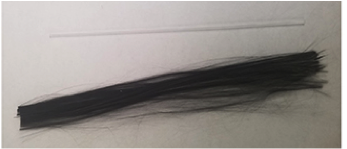

2.	In glass tube permanently mounted to a glass slide at ~30 degrees with modeling clay (fig.1b), pipette a couple of mL of 100% isopropanol into the glass tube and then place a single glass capillary into the same tube.  The isopropanol will enter and fully fill the glass capillary with ease; the level of isopropanol can be adjusted accordingly.

1b

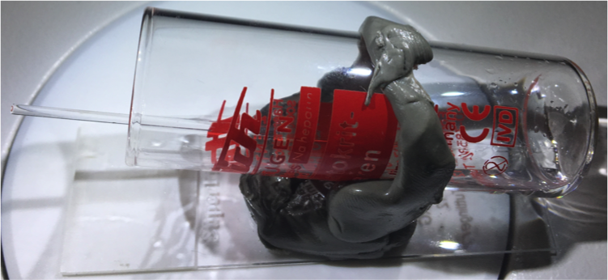

3.	Place the capillary/mounted glass tube combo under the binocular objective lens and focus the exposed capillary tip at the binoculars highest magnification.
4. With a combination of hands and fine tweezers, isolate a single fiber from the bundle and attempt to insert one end into the capillary under the binocular.
6. Once the initial portion of the fiber is inserted into the capillary, with the assistance of the isopropanol already in the capillary, one can continuously and gently “push” the fiber further into the capillary by either using a combination of the fine tweezers and fingers or even just with finger alone.
7. Once its obvious that the fiber can no further be inserted into the capillary, there should still be a significant length of fiber sticking out of the capillary. Carefully pickup the loaded capillary and allow the isopropanol to drip back into the mounted glass tube. There will always be a small amount of isopropanol that resides in the capillary; this can be easily shaken out while keeping the fiber loaded into the capillary.
8. Hold up the capillary to good light and inspect the length of fiber that sticks out of each end of the capillary (fig.1c). There should be enough for handling the fiber with fingers in later steps. If this is not the case, then the loaded capillary must be placed back into the glass tube with isopropanol for adjusting, or the fiber is simply too short which then a new longer one must be used instead.

1c

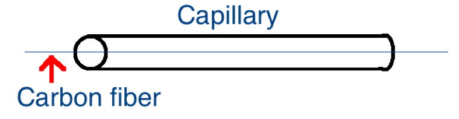

9.	Place the loaded capillary horizontally in a petri dish with a strip of modeling clay running down in the middle. Repeat steps 3-7 for a desired amount of loaded capillaries.
10.	Once the amount of desired loaded capillaries has been reached, allow the load capillaries to dry for a proper amount of time (~1hour), so there is no remaining isopropanol in the capillaries for the next step.

## Forming a liquid tight seal around the carbon fiber

1. While waiting for isopropanol to dry, turn on the vertical puller and let it warm up for ~30 minutes prior to use.
2. Once the loaded capillaries are completely dry of isopropanol, take a loaded capillary and adjust the carbon fiber at the ends so at one end of the capillary has a much shorter fiber length than the other (fig.2a). The shorter length should still be long enough though to allow for manual fiber adjustment in the consecutive steps.

2a

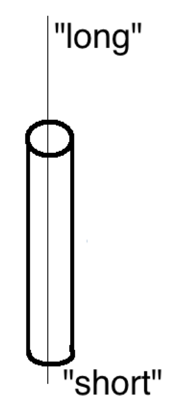

3.	Once the loaded capillary has been adjusted, mount it onto the vertical puller so that the capillary end with the “shorter” fiber goes through the filament and the end with the “longer” fiber stays at the top half of the puller (fig.2b).

2b

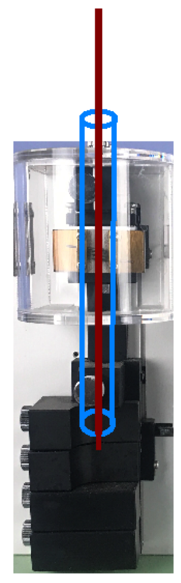

4. Currently, since most of the time the puller yields better capillary tapers for the bottom half of the capillary, it is advised to adjust the fiber in the capillary once again so the bottom end of the capillary has the “longer” fiber and the top half has the “shorter” fiber (fig.2c).  Currently the ideal temp settings are T1(98.4) and T2(62.7). The circumstance may change if the fabricator experiences a change in successful capillary taper or if the filament must be replaced and the temperature parameters must be reset.

2c

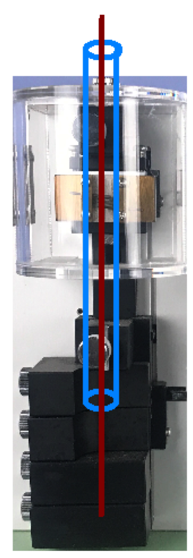

5. Once the loaded capillary has been loaded onto the vertical puller, initiate the 2-step pull protocol with the appropriate temperature settings. Once the capillary has been pulled there should be carbon fiber running through the vertical plane of the puller, going through the 2 halves of the capillary and filament. Use a small pair of scissors to cut the fiber halfway between the 2 capillary tips, and do so in a careful manner so to avoid any mechanical stress on the tapered tips.
6. Carefully take out each half of the loaded/tapered capillary and inspect the tip under a strong magnification microscope. By examining the tip under various objectives, an ideal capillary half would consist of a straight taper of ~300-400µm long and the fiber filling out almost the whole entire capillary (fig.2d). It is recommended that any capillary halves that don’t fulfill this criteria to be discarded for they would yield non-ideal background current signals.

2d

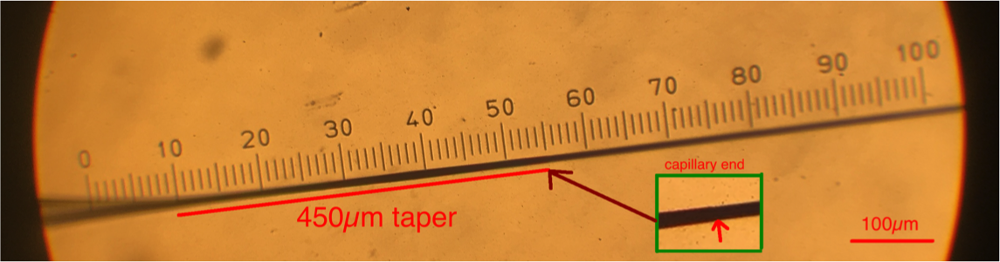

7. Steps 2-6 may be repeated for sequential loaded capillaries until the desired amount of tapered tips are reached

## Trimming fiber tips

1. Take slide and cover the clear end with parafilm in a way so it’s as flat as possible. Then place 2 ball-shaped pieces modeling clay along the middle of the longitudinal plane of the slide for mounting the capillary in consecutive step
2. Carefully mount a tapered capillary onto the pieces of modeling clay so that the body of the capillary rests on the clay the tapered tip “hovers” above the parafilm. With the capillary in this position very carefully lower the tapered tip onto the parafilm end of the slide so that the fiber lays completely flat on the slide and the tapered capillary tip isn’t cracked (fig.3a)

3a

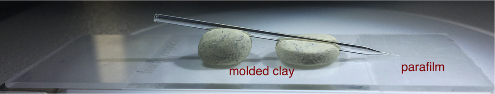

3. Once the tip is successfully mounted onto the parafilm glass slide, place this combo under the binocular and focus the capillary tip at maximum magnification with maximum illumination
4. Take a blade mounted on a handle and sever the fiber ~150-200µm from the tapered tip of the capillary (fig. 3b).

3b

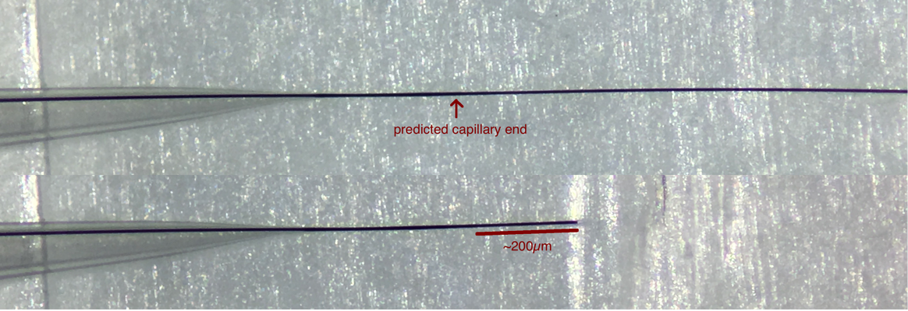

4. Once the fiber has been trimmed, leaving the capillary mounted the parafilm glass slide, inspect the tip in the high magnification microscope. The tapered seal should still be intact and the trimmed fiber edge should be flat and the exposed length is indeed ~150-200µm (fig.3c).

3c
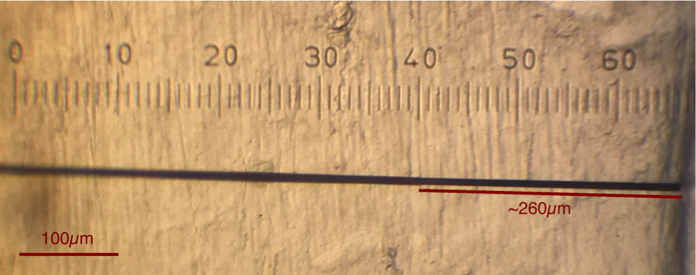

4.	Gently remove the trimmed capillary and place it back in the petri dish with clay holder and continue steps 2-4 for desired amount of tips.

## Forming an electrical conenction

1. Take a slide and add either 1 or 2 ball-shaped pieces of clay onto the middle of the slide’s longitudinal axis. Mount the trimmed capillary onto the clay so that it rests parallel to the glass slide. Take this combo and place it under the binocular and focus the non-tapered end of capillary at half max magnification.
2. Take a pin soldered with stainless steel conductive wire (Fig.4a) and add a generous amount of silver paint onto the top half of the conductive wire (non-pin side).

4a

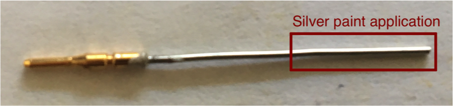

3. Take the painted wire/pin and gently insert it  completely into the capillary via the non-tapered end. The electrode can be inspected and slightly rotated on the clay to ensure that the electrical connection is formed between the carbon fiber and conductive wire via the silver paint, and the carbon fiber hasn’t snapped within the capillary
4. Allow the silver paint to dry (~15-60min). Once this occurs, cut 0.5-1.5 cm of the shrink tube  (just enough to stabilize the pin/capillary junction), place the tube over the pin/capillary junction and use the soldering wand to heat shrink the tube onto the electrode
5. Inspect the tip once again under the strong magnification microscope, measure and annotate the exposed fiber length, and then the electrode is ready for activation and experimental use (fig.4b).

4b

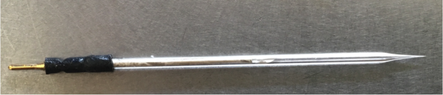
